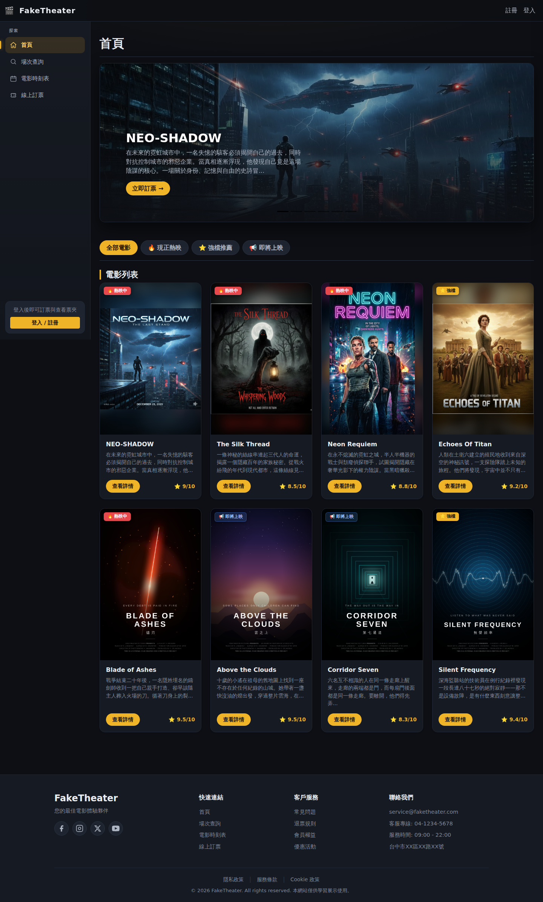
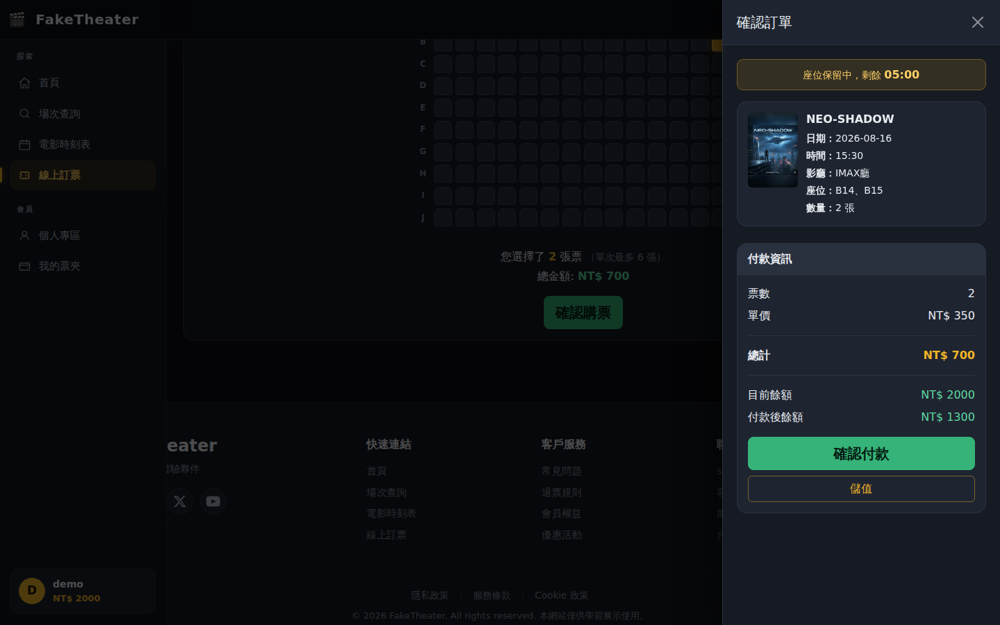
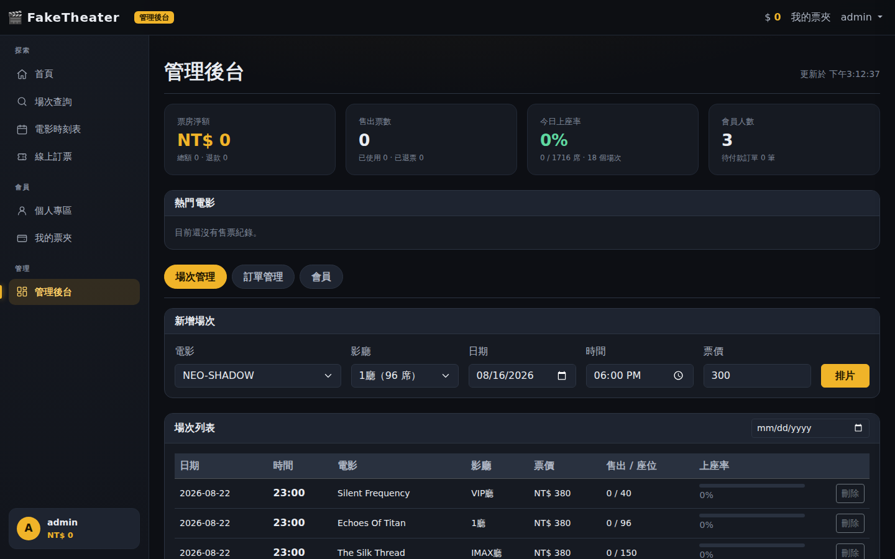

# FakeTheater 電影購票系統

[](https://github.com/Leo0049/projectLab/actions/workflows/test.yml)
[](LICENSE)

<!-- 部署完成後把下面這行的註解拿掉，並換成實際網址：
**線上展示：** https://你的網址 　|　展示帳號 `demo` / `demo123`
-->



全端電影購票系統。Node.js + Express + SQLite，前端原生 JavaScript + Bootstrap 5，無打包工具。

**售票系統真正的難題不是畫面，而是兩個人同時搶最後一個位子時會發生什麼事。**
這個專案把該問題當作核心：座位保留、交易隔離、部分唯一索引三層防護，
並用「20 個並發請求」與「4 個獨立行程」兩種測試證明它擋得住。

| 選位與座位保留倒數 | 管理後台的營運儀表板 |
|---|---|
|  |  |

## 快速開始

需要 Node.js 22 以上（`better-sqlite3` 13 的最低需求）。

```bash
npm install
npm start
# 開啟 http://localhost:3000
```

第一次啟動會自動建立 SQLite 資料庫、匯入電影資料、建立展示帳號，並排入未來 7 天的場次。
之後每次啟動都會補齊場次，所以隔幾週再打開也不會變成空的。

### 展示帳號

| 帳號 | 密碼 | 初始餘額 |
|---|---|---|
| `demo` | `demo123` | 2000 |
| `johndoe` | `password123` | 1000 |
| `janedoe` | `securepass` | 500 |
| `admin` | `admin123` | 0（管理員，可進管理後台） |

這些帳號定義在 `server/db/seed-data/users.json`，匯入時會經過 bcrypt hash，
資料庫裡不存明文。該檔案位於伺服器端而非公開目錄，不會被 HTTP 讀取
（`tests/api.js` 有測試確認 `/data/users.json` 回 404）。

`admin123` 只適用於本機。部署到公開網址時必須用環境變數 `ADMIN_PASSWORD` 換掉——
它寫在原始碼與這份 README 裡，等於沒有密碼。設定後預設值就會失效，
`NODE_ENV=production` 時沒設定則伺服器直接拒絕啟動。

### 執行測試

```bash
npx playwright install chromium   # 只有第一次需要
npm test          # 後端 127 項 + 瀏覽器 83 項
npm run test:api  # 只跑後端
npm run test:e2e  # 只跑瀏覽器
```

兩份測試都會各自建立一個暫存資料庫，不會動到開發資料。

## 專案結構

```
server/                 後端
  index.js              啟動點
  app.js                Express 組裝與資料庫初始化
  config.js             設定（port、JWT、鎖定時效…）
  db/
    schema.sql          資料表定義
    index.js            連線、WAL、交易輔助、欄位遷移
    seed.js             匯入種子資料、排片
    seed-data/*.json    種子資料（伺服器端，不對外公開）
  middleware/           JWT 驗證、管理員授權、錯誤處理
  payments/signature.js 綠界 CheckMacValue 簽章演算法
  routes/               API 端點（含模擬金流商 sandbox.js）
  services/             座位鎖定、訂票退票、金流、後台的核心邏輯
  utils/                日期、HTTP 錯誤、分頁、網址信任邊界

FakeTheater/            前端（由 Express 直接提供）
  *.html                七個頁面
  js/api.js             API client，前端唯一對外的資料入口
  js/auth.js            登入狀態與錢包
  js/sidebar.js         共用側邊欄（依角色顯示不同項目）
  js/infinite-scroll.js 共用的無限滾動元件
  js/booking.js         訂票頁
  js/checkout-sidebar.js結帳側邊欄（含座位保留倒數）
  js/wallet-sidebar.js  票夾（使用、退票）
  js/admin.js           管理後台
  css/custom.css        深色主題與所有自訂樣式

tests/
  api.js                後端整合測試（含並發與安全性）
  e2e.js                瀏覽器端對端測試
  helpers/              並發測試的工作行程、設定探測子行程

Dockerfile              兩階段建置，最終映像不含編譯工具鏈
render.yaml             Render Blueprint
fly.toml                Fly.io 設定
.env.example            環境變數範本
```

## 座位並發控制

三層防護，由外到內：

**第一層：選位保留（seat_locks）**
按下「確認購票」時，伺服器會把座位寫入 `seat_locks` 並給 5 分鐘期限。
在這段時間內其他人看到的就是「他人選位中」，選不下去。
結帳側邊欄會顯示倒數，時間到自動放棄；使用者主動關閉也會立刻歸還。
過期的鎖不需要背景排程清理——每次查詢或鎖定前會先刪掉過期列。

**第二層：交易隔離（BEGIN IMMEDIATE）**
付款時「檢查座位 → 檢查餘額 → 扣款 → 建立訂單 → 寫入座位 → 記錄交易 → 釋放鎖」
全部在同一筆 `BEGIN IMMEDIATE` 交易內完成。`IMMEDIATE` 在交易開始時就取得寫入鎖，
避免兩筆交易都讀完才發現要寫同一列。任何一步失敗整筆回滾，
不會出現「扣了錢沒有票」或「有票沒扣錢」。

**第三層：資料庫唯一索引**
```sql
CREATE UNIQUE INDEX idx_booking_seats_unique
    ON booking_seats (showtime_id, seat_row, seat_col)
    WHERE status != 'refunded';
```
就算前兩層都被繞過，資料庫也不可能讓同一個位子存在兩筆未退票紀錄。
這是唯一不依賴應用層邏輯正確性的保證。用「部分」索引是為了讓退票後的紀錄留著對帳，
同時把位子釋放出來重新賣（見〈退票〉）。

### 測試怎麼證明

`tests/api.js` 最後兩段：

- **20 個 HTTP 請求同時搶同一個座位** → 恰好 1 個回 201，其餘 19 個回 409
- **4 個獨立的 Node 行程同時寫入同一個座位** → 仍然只有 1 個成功

第二個測試特別重要：Node 是單執行緒，單一行程內的測試無法排除「只是剛好沒有真的並行」。
用多行程直接打同一個資料庫檔案，驗證的才是資料庫層的保證。

## 金流（沙盒）

**購票是從錢包餘額扣款，儲值才走金流。** 這樣金流的整合面積小、責任單一，
也符合多數售票 App 的做法。系統裡沒有任何「不用付錢就能加值」的端點。

付款流程與綠界 ECPay 正式環境一致：

```
使用者按下儲值
      │
      ▼
POST /api/payments/deposit      建立 pending 訂單，回傳已簽章的表單參數
      │
      ▼
表單 POST 到金流商付款頁          沙盒是 /sandbox/checkout，正式環境改成綠界網址
      │
      ├─ 伺服器對伺服器通知 ─→ POST /api/payments/webhook   ← 真正入帳的地方
      │                          驗簽 → 比對金額 → 入帳（冪等）
      ▼
瀏覽器導回 profile.html?order=…  前端再向後端確認訂單狀態，不相信網址參數
```

簽章使用綠界的 **CheckMacValue** 演算法（`server/payments/signature.js`）：
參數字典序排序 → 前後接上 HashKey/HashIV → .NET 風格 URL encode → SHA256 → 轉大寫。
驗證時用 `timingSafeEqual` 比對，避免以回應時間推測正確簽章。

三個容易寫錯、測試都有涵蓋的地方：

| 風險 | 作法 |
|---|---|
| 偽造回調 | 簽章驗證失敗直接 400，不入帳 |
| 竄改金額 | 以我方訂單金額為準，回調金額不符就標記失敗 |
| 重複通知 | 訂單進入終態（paid / failed）後不再變更，金流商重送也只入帳一次 |
| 逾時後才付款 | `expired` 是我方自訂的逾時，不代表金流商沒收到錢，仍會入帳並留下警告 |
| SSRF | 沙盒的伺服器對伺服器回調位址由連線的實際本地位址組出，完全不看外部輸入 |
| 開放轉址 | 返回頁一律降級成相對路徑，絕對網址還必須與 `PUBLIC_URL` 同源 |

要換成真的綠界／藍新：把 `PAYMENT_PROVIDER` 改掉（沙盒路由就不會再掛載）、
`createDepositOrder()` 裡的 `action` 換成金流商網址、填入正式的 MerchantID 與金鑰。
參數與簽章規則完全不用動。

## 退票

| 規則 | 說明 |
|---|---|
| 可退條件 | 票券狀態為「未使用」 |
| 時間限制 | 開演前 30 分鐘起不受理（`REFUND_CUTOFF_MINUTES`） |
| 退款金額 | 票價扣除 10% 手續費（`REFUND_FEE_RATE`） |
| 座位處理 | 立刻釋出，可以重新賣給別人 |

退票後座位怎麼「既留下紀錄又能重新賣出」？靠**部分唯一索引**：

```sql
CREATE UNIQUE INDEX idx_booking_seats_unique
    ON booking_seats (showtime_id, seat_row, seat_col)
    WHERE status != 'refunded';
```

已退票的列被排除在索引之外，所以同一個座位可以同時存在「一筆已退票」與「一筆新售出」，
歷史紀錄完整保留，也不需要刪除任何資料。

## 管理後台

以 `admin` 帳號登入後，側邊欄會出現「管理後台」。權限判斷在伺服器
（`requireAdmin` 中介層一律從資料庫讀角色，不看權杖內容），
一般會員即使直接開 `admin.html`，每支 API 也都會回 403。

- **營運儀表板**：票房淨額（總額 − 退款）、售出／已使用／已退票張數、今日上座率、熱門電影排行
- **場次管理**：排片、刪除（已售票的場次擋下）、依日期篩選、各場次上座率
- **訂單管理**：跨使用者的訂單與座位明細，可代客退票
- **會員列表**：餘額、訂單數、持票數

## 安全性設計

下表每一列都對應到 `tests/api.js` 裡的測試，不是口號。

| 項目 | 作法 |
|---|---|
| 密碼 | bcrypt hash（cost 10），資料庫無明文 |
| 種子資料 | 放在伺服器端目錄，不會被靜態服務公開 |
| 認證 | JWT Bearer token，有效期 7 天 |
| 餘額 | 一律以資料庫為準，前端傳來的金額完全不採信 |
| 授權 | 票券、交易紀錄都以 token 中的使用者為範圍查詢 |
| 授權分級 | 管理端點需 admin 角色，角色一律從資料庫讀取而非權杖內容 |
| 加值 | 沒有可直接加值的端點，一律經過金流回調並驗簽 |
| 金流回調 | CheckMacValue 驗簽 + 金額比對 + 冪等 + 失敗標記持久化 |
| SSRF | 伺服器主動發出的請求位址不接受任何外部輸入 |
| 開放轉址 | 轉址目標一律是相對路徑 |
| 錯誤訊息 | 帳號不存在與密碼錯誤回同一句話，避免被用來列舉帳號 |
| 輸入驗證 | 座位範圍、張數上限、金額上下限、分頁上下界都在伺服器檢查 |
| XSS | 前端所有動態插入的內容都經過 `escapeHtml()` |
| 錯誤回應 | 非預期錯誤只回通用訊息，不洩漏堆疊或 SQL |
| 部署預設值 | 正式環境未設定 `JWT_SECRET` 或 `ADMIN_PASSWORD` 時拒絕啟動 |
| 代理標頭 | 預設不信任 `X-Forwarded-*`，需由部署方明確開啟 `TRUST_PROXY` |

## API

所有端點都在 `/api` 之下。需要登入的請帶 `Authorization: Bearer <token>`。

### 認證

| 方法 | 路徑 | 說明 |
|---|---|---|
| POST | `/api/auth/register` | 註冊，回傳 user 與 token |
| POST | `/api/auth/login` | 登入，回傳 user 與 token |
| GET | `/api/auth/me` | 取得目前登入者（餘額以資料庫為準）🔒 |
| PATCH | `/api/auth/me` | 修改用戶名，補發 token 🔒 |

### 電影與場次

| 方法 | 路徑 | 說明 |
|---|---|---|
| GET | `/api/movies?category=` | 電影列表，可依分類篩選 |
| GET | `/api/movies/:id` | 單部電影 |
| GET | `/api/theaters` | 影廳列表 |
| GET | `/api/showtimes?movieId=&date=&theaterId=` | 場次，自動排除已開演的 |

### 座位與訂票

| 方法 | 路徑 | 說明 |
|---|---|---|
| GET | `/api/showtimes/:id/seats` | 座位圖：已售出、他人保留中、自己保留中 |
| POST | `/api/showtimes/:id/locks` | 保留座位，回傳到期時間 🔒 |
| DELETE | `/api/showtimes/:id/locks` | 放棄保留 🔒 |
| POST | `/api/bookings` | 付款並開票 🔒 |

### 票券與錢包

| 方法 | 路徑 | 說明 |
|---|---|---|
| GET | `/api/tickets` | 我的票券（未使用／歷史）🔒 |
| POST | `/api/tickets/:id/use` | 進場，開始倒數 🔒 |
| GET | `/api/tickets/stats` | 票券統計 🔒 |
| POST | `/api/tickets/:id/refund` | 退票 🔒 |
| GET | `/api/wallet/transactions` | 交易紀錄（分頁）🔒 |

### 金流

| 方法 | 路徑 | 說明 |
|---|---|---|
| POST | `/api/payments/deposit` | 建立儲值訂單，回傳金流商表單 🔒 |
| POST | `/api/payments/webhook` | 金流商回調（以簽章驗身分，不需登入） |
| GET | `/api/payments/orders/:orderNo` | 查詢訂單狀態 🔒 |
| GET | `/api/payments/orders` | 儲值紀錄（分頁）🔒 |

### 管理後台（需 admin 角色）

| 方法 | 路徑 | 說明 |
|---|---|---|
| GET | `/api/admin/stats` | 營運儀表板 |
| GET | `/api/admin/showtimes` | 場次列表（含上座率、分頁） |
| POST | `/api/admin/showtimes` | 排片 |
| DELETE | `/api/admin/showtimes/:id` | 刪除場次（已售票則擋下） |
| GET | `/api/admin/bookings` | 所有訂單（分頁） |
| GET | `/api/admin/users` | 會員列表（分頁） |
| POST | `/api/admin/tickets/:id/refund` | 代客退票 |

## 資料表

```
users           帳號、bcrypt hash、餘額、角色（user / admin）
movies          電影
theaters        影廳（排數 × 每排座位數）
showtimes       場次   UNIQUE(theater_id, date, time)  同廳同時段不能排兩場
bookings        訂單（含已退款金額與狀態）
booking_seats   訂單中的每個座位
                └ 部分唯一索引 (showtime_id, seat_row, seat_col) WHERE status != 'refunded'  ← 防超賣
seat_locks      選位暫時保留     PRIMARY KEY(showtime_id, seat_row, seat_col)
transactions    儲值、購票、退票紀錄
payment_orders  金流訂單（pending / paid / failed / expired）
```

每個座位是 `booking_seats` 的一列，也就是一張獨立票券，可以分開使用。

## 頁面

| 檔案 | 說明 |
|---|---|
| `index.html` | 首頁：主視覺輪播、分類篩選、電影卡 |
| `showtime.html` | 場次查詢：依電影分組，時段以時間為主視覺 |
| `schedule.html` | 電影時刻表：未來 7 天 |
| `movie-detail.html` | 電影詳情與該片所有場次 |
| `booking.html` | 線上訂票：選片 → 日期 → 場次 → 選位 → 結帳 |
| `profile.html` | 個人專區：餘額、票券統計、改名、消費紀錄（無限滾動） |
| `admin.html` | 管理後台（僅 admin 可用） |

訂票頁可用網址帶入場次：`booking.html?showtime=12&movie=1&date=2026-08-11&time=18:00`

## 介面設計

全站影院深色主題，透過 Bootstrap 5.3 的 `data-bs-theme="dark"` 打底，
實際色值由 `css/custom.css` 最上方的 CSS 變數控制。要改風格只要動那一區：

| 用途 | 變數 | 說明 |
|---|---|---|
| 底色層次 | `--ft-bg` / `--ft-surface` / `--ft-surface-2` / `--ft-surface-3` | 由深到淺 |
| 文字 | `--ft-text` / `--ft-text-dim` / `--ft-text-muted` | 主要／次要／輔助 |
| 強調 | `--ft-gold` | 主要動作、選取狀態、強調數字 |
| 語意 | `--ft-red` / `--ft-green` | 紅色只用於「現正熱映」，綠色只用於金額與付款成功 |

所有文字與背景組合皆通過 WCAG AA（對比度 ≥ 4.5）。

側邊欄由 `js/sidebar.js` 統一產生（原本六個頁面各複製一份），
會依登入狀態與角色顯示「會員」與「管理」區塊。

### 無限滾動

`js/infinite-scroll.js` 是共用元件，用 `IntersectionObserver` 監看列表尾端的哨兵元素，
目前用在場次查詢、消費紀錄與後台的三張表。處理了幾個容易忽略的細節：

- 載入後哨兵若仍在畫面內，重新 `observe` 一次讓它繼續載，不會卡住
- 每次重新查詢會遞增 generation，丟棄前一次查詢晚回來的結果
- 載入中／已到底／載入失敗（可重試）三種狀態都有對應畫面

## 環境變數

完整範本見 [`.env.example`](.env.example)。本機開發全部都有可用的預設值，不需要設定任何一個。

| 變數 | 預設 | 說明 |
|---|---|---|
| `JWT_SECRET` | 開發用預設值 | **正式環境必須設定**，未設定時伺服器會拒絕啟動 |
| `ADMIN_PASSWORD` | 沿用種子資料 | **正式環境必須設定**，會覆寫管理員密碼並使 `admin123` 失效 |
| `PUBLIC_URL` | 由 Host 標頭推導 | 對外網址。Host 可被偽造，正式環境請明確設定 |
| `TRUST_PROXY` | 關閉 | 部署在反向代理後方時設為 `1`，才會採信 `X-Forwarded-Proto` |
| `DB_PATH` | `server/data/faketheater.db` | 資料庫檔案位置 |
| `PORT` | `3000` | 伺服器連接埠 |
| `SEAT_LOCK_TTL_MS` | `300000` | 座位保留時間 |
| `PAYMENT_PROVIDER` | `sandbox` | 改成其他值就不會掛載沙盒金流路由 |
| `PAYMENT_ORDER_TTL_MS` | `900000` | 金流訂單多久未付款就失效 |
| `REFUND_FEE_RATE` | `0.1` | 退票手續費比例，設 `0` 表示不收 |
| `REFUND_CUTOFF_MINUTES` | `30` | 開演前幾分鐘停止受理退票 |

想在本機用這些設定，Node 內建就能讀 `.env`，不需要額外套件：

```bash
cp .env.example .env    # 填好後
node --env-file=.env server/index.js
```

## 部署

專案沒有前端建置步驟，容器啟動後直接 `node server/index.js` 就是完整的站台。
根目錄已備妥 [`Dockerfile`](Dockerfile)、[`render.yaml`](render.yaml)、[`fly.toml`](fly.toml)。

映像分兩階段：第一階段安裝相依套件（`better-sqlite3` 是原生模組，
沒有預編譯檔時需要編譯工具鏈），第二階段只帶走結果，
最終映像約 98 MB、以非 root 的 `node` 使用者執行，並內建 `/api/health` 健康檢查。

### Render

後台 **New → Blueprint** 選這個 repo，它會讀 `render.yaml` 自動建立服務。
`JWT_SECRET` 與 `ADMIN_PASSWORD` 由 Render 產生隨機值（在 Environment 頁面可以看到），
部署完成後把拿到的網址填進 `PUBLIC_URL` 再重新部署一次即可。

free 方案不支援持久化磁碟，重新部署或休眠後資料會回到種子狀態；
對展示來說沒問題（每次啟動都會重新匯入電影並排入未來 7 天場次），
要保留訂票紀錄的話把方案改成 starter 並解開 `render.yaml` 裡的 `disk` 區塊。
另外 free 方案的服務閒置後會休眠，第一個訪客大約要等 50 秒才會看到頁面。

### Fly.io

```bash
fly launch --no-deploy --copy-config
fly volumes create faketheater_data --size 1 --region nrt
fly secrets set JWT_SECRET="$(openssl rand -hex 32)" ADMIN_PASSWORD="你的密碼"
fly secrets set PUBLIC_URL="https://你的app名稱.fly.dev"
fly deploy
```

`fly.toml` 已掛好 `/data` 的 volume，資料跨部署保留。
一顆 volume 只能給一台 machine 用，所以這個服務不要橫向擴充。

### 本機用 Docker 跑一次

```bash
docker build -t faketheater .
docker run -p 3000:3000 -v faketheater-data:/data \
  -e JWT_SECRET="$(openssl rand -hex 32)" \
  -e ADMIN_PASSWORD="local-admin" \
  faketheater
```

### 部署時要注意的三件事

- **`ADMIN_PASSWORD` 一定要設**。沒設定時 `NODE_ENV=production` 的伺服器會拒絕啟動，
  這是刻意的——公開網址上的管理後台不能用 README 寫著的密碼進得去。
  改設定後重新部署時，既有資料庫裡的舊密碼也會一併被覆寫。
- **`TRUST_PROXY=1`**。平台的反向代理用 `X-Forwarded-Proto` 告知原始通訊協定，
  不開這個的話 `req.protocol` 永遠是 `http`，金流表單的對外網址會組成 `http://`
  而在 https 站台上被瀏覽器擋掉。反過來說，沒有代理時開著它等於讓任何人偽造來源 IP，
  所以預設關閉、由部署方明確開啟。
- **`DB_PATH` 要指向持久化磁碟的掛載點**。映像預設是 `/data/faketheater.db`，
  沒掛磁碟也能跑，只是每次重新部署會回到種子資料。

## 技術決策

幾個「為什麼這樣做」比「做了什麼」更值得說明的地方。

### 為什麼不接真實金流，只做沙盒

這是一間虛構影城、放的是不存在的電影。收真錢等於賣一張無法兌現的票，
那不是技術問題而是交付問題。台灣金流上線還需要公司或商業登記，
一碰真卡號就進入 PCI-DSS 範圍。

沙盒展示的技術是一模一樣的：訂單狀態機、CheckMacValue 簽章與驗簽、
webhook 冪等、金額比對。差別只在最後一組金鑰。

### 為什麼購票扣錢包餘額，而不是每次都走金流

把金流限縮在「儲值」一個入口，購票就只是一筆本地交易，
可以完整包在 `BEGIN IMMEDIATE` 裡跟座位一起成功或一起失敗。
如果每次購票都要等外部金流回調，就得處理「錢收了但座位被搶走」的補償流程，
複雜度高很多，而多數售票 App 也是走儲值制。

### 為什麼用部分唯一索引，而不是退票時刪除資料

退票後座位要能重新賣出，但紀錄不能消失（要對帳）。
若用一般的唯一約束，這兩件事只能二選一。
`WHERE status != 'refunded'` 讓已退票的列被排除在索引外，
同一個座位因此可以同時存在「一筆已退票」與「一筆新售出」。

### 為什麼並發測試要開多個行程

Node 是單執行緒，`better-sqlite3` 又是同步的，
單一行程內的「並發」測試其實從頭到尾都沒有真的並行——
就算防護是壞的也會通過。用 4 個獨立行程直接寫同一個資料庫檔，
驗證的才是資料庫層的保證，而不是事件迴圈剛好幫忙排隊。

### 為什麼安全性表格要對得回測試

專案初期 README 寫著「資料庫裡沒有明文密碼」——這句話是對的，
但 `data/users.json` 當時放在靜態目錄下，`curl` 一下就能拿到 admin 密碼。
宣稱本身沒錯，卻給人錯誤的整體印象。
現在每一列都有對應的測試，改壞了測試就會紅，而不是等別人發現。

### 為什麼海報是用瀏覽器「截」出來的

換掉真實電影素材時需要四張新海報，但這個環境沒有任何影像處理套件
（沒有 Pillow、沒有 ImageMagick、沒有 sharp）。有的是 Chromium。

於是海報改用 HTML + SVG 排版——漸層、高斯模糊、混合模式、字距、
底片顆粒（`feTurbulence`）全都是瀏覽器本來就會的事——再用 Playwright
以固定視窗尺寸截圖輸出 800×1200。同一套程式也產出 1600×900 的橫式主視覺。

順帶解決了另一個問題：原有四張海報的長寬比各不相同（有一張是正方形），
卡片用 `object-fit: cover` 裁切後標題會被切掉。統一重繪成 2:3
（完整海報置中、四周用同一張圖放大模糊墊底）之後，八張才真的整齊。

手上沒有理想的工具時，先問「現有的工具能不能做到」往往比先找新工具快。

### 為什麼正式環境要「沒設定就拒絕啟動」

`JWT_SECRET` 與 `ADMIN_PASSWORD` 的預設值都公開在原始碼裡。
用預設值上線不會有任何錯誤訊息，站台看起來一切正常——
只是任何人都能簽出合法的 token，或用 README 上的密碼進管理後台。
這種「安靜地不安全」比啟動失敗糟得多，所以 `NODE_ENV=production`
時直接讓行程結束，把問題推到部署當下而不是被人發現的時候。

`ADMIN_PASSWORD` 還會覆寫既有資料庫裡的密碼。
種子資料用的是 `INSERT OR IGNORE`（避免洗掉使用者改過的餘額），
若管理員也照這個規則，掛了持久化磁碟之後改密碼就完全不會生效。

### 為什麼 TRUST_PROXY 預設是關的

`X-Forwarded-*` 是可以被任何人在請求裡寫上的標頭，
它之所以可信，唯一的理由是「前面確實有一層代理會覆寫它」。
預設開啟等於在沒有代理的環境下讓任何人偽造來源 IP 與通訊協定；
預設關閉則只會讓對外網址組成 `http://`——後者一眼就看得出來，
前者不會有任何徵兆。把它交給部署方明確宣告，是因為只有部署方知道答案。

### 測試通過不等於沒有 bug

這個專案曾經在 179 項測試全綠的狀態下，被複查找出 9 個真實問題，
包括上面那個靜態目錄洩漏。原因很單純：測試走的都是正常路徑，
而那些問題都在「使用者慢了 15 分鐘才付款」「有人自己 POST 這個表單」
「有人直接開這個網址」這類路徑上。

修正時每一個都補了回歸測試，也因此後端測試從 44 項成長到 127 項——
其中相當比例是安全性與邊界情境，不是功能。

## 已知限制

這是作品展示用的專案，以下是刻意保留的簡化：

- **金流是沙盒，不是真實交易**。付款頁與回調由本專案模擬，簽章演算法與流程和綠界正式環境相同，
  但不會向任何金融機構請款。這是一間虛構影城、放的是不存在的電影，收真錢等於賣無法交付的商品。
- **「Google 登入」是模擬的**，固定綁在一組展示帳號上，不會真的走 OAuth。
- **票券 QR Code 是 Canvas 畫的示意圖案**，不是可掃描的真實 QR 編碼。
- 沒有寄送 email／簡訊通知。
- 金流只實作信用卡一種付款方式。
- SQLite 單機資料庫，沒有做讀寫分離或多機部署。
  座位並發的三層防護在多行程下已驗證有效，但跨主機需要換成 PostgreSQL 之類的方案。

## 素材與授權

程式碼以 [MIT 授權](LICENSE) 釋出。

站上的八部電影全部是虛構的，海報與主視覺也都是本專案自製，沒有使用任何真實作品的素材：

- `pic/1`–`pic/4` 由 AI 生成後重新裁切為統一的 2:3 版面
- `pic/5`–`pic/8` 以 HTML/SVG 排版後用 Chromium 截圖產生（見〈技術決策〉）

這件事不只是版權考量。README 解釋「為什麼不接真實金流」時的理由是
「這是一間虛構影城、放的是不存在的電影」——片單裡只要有一部是真的，這個論述就不成立。
